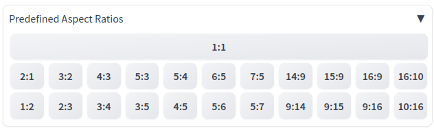

# Extension for the AUTOMATIC1111 Web UI

sd-webui-predefined_aspect_ratios is an <i>Extension</i> for the <a href="https://github.com/AUTOMATIC1111/stable-diffusion-webui">AUTOMATIC1111/stable-diffusion-webui</a>, which is adding buttons to the web UI for the selection of predefined <i>aspect ratios</i>.

## Preface

The existing solutions [3,4,5] were much to complex for my personal needs. I have therefore decided to use this case to programme an <i>Extension</i> for learning purposes. The result of my first efforts can be found here. The presented version does nothing else, than adding a panel with predefined aspect ratios to the web UI. The predefined <i>aspect ratios</i> cover the most common ones in use.

## User Case

The <i>Extension</i> was developed for use with SD 1.5. The assumptions subsequently presented are basses on my experiences with AUTOMATIC1111 and SD 1.5. As technology is constantly advancing, there is no guarantee that these assumptions will hold in the long term.

## Assumptions

There are one rule when creating AI images, which is crucial. A Ai generated immage should be as small as possible. But, the resolution for the image to be created should not be smaller than 512 pixel in one of the both possible directions. For the <i>Extension</i> one resolution is all the time 512 pixel. The quotient of the divison from the chosen aspect ratio may be a floating point number. Height or witdth my be rounded values.

## Selector Buttons for Predefined Aspect Ratios

Following aspect ratios are implemented:

**No specific (square) Orientation**

* 1:1 → 512 x 512 pixel

**Orientation Landscape**

* 2:1 → 1024 x 512 pixel → (Factor 2)
  
* 3:1 → 1536 x 512 pixel → (Factor 3)
  
* 4:1 → 2048 x 512 pixel → (Factor 4)

* 3:2 → 768 x 512 pixel → (Factor 1.5)

* 4:3 → 683 x 512 pixel → (Factor 1,333984375)

* 5:3 → 853 x 512 pixel → (Factor 1,666015625) 

* 5:4 → 640 x 512 pixel → (Factor 1.25) 

* 6:5 → 614 x 512 pixel → (Factor 1,19921875) 

* 7:5 → 717 x 512 pixel → (Factor 1,400390625) 

* 14:9 → 796 x 512 pixel → (Factor 1,5546875) 

* 15:9 → 853 x 512 pixel → (Factor 1,666015625) 

* 16:9 → 910 x 512 pixel → (Factor 1,77734375)

* 16:10 → 819 x 512 pixel → (Factor 1,599609375) 

**Orientation Portrait**

* 1:2 → 512 x 1024 pixel → (Factor 0.5)

* 1:3 → 512 x 1536 pixel → (Factor 0,333333333)

* 1:4 → 512 x 2048 pixel → (Factor 0,25)

* 2:3 → 512 x 768 pixel → (Factor 0,666666667)

* 3:4 → 512 x 683 pixel → (Factor 0,749633968)

* 3:5 → 512 x 853 pixel → (Factor 0,600234467) 

* 4:5 → 512 x 640 pixel → (Factor 0.8) 

* 5:6 → 512 x 614 pixel → (Factor 0,833876221) 

* 5:7 → 512 x 717 pixel → (Factor 0,714086471) 

* 9:14 → 512 x 796 pixel → (Factor 0,64321608)

* 9:15 → 512 x 853 pixel → (Factor 0,600234467)

* 9:16 → 512 x 910 pixel → (Factor 0,562637363)

* 10:16 → 512 x 819 pixel → (Factor 0,625152625)

## What the Extension Does

After installation one will find a button panel within the web UI which looks like the next one.

## Known Problems

After installation of the Extension it could be that the web UI has to be reloaded from the browser that the Extension can be used.

## Related Tools

I wrote some tools for dealing with aspect ratios. These tool can be find at 
<a href="https://github.com/zentrocdot/artificial-intelligence-tools/tree/main/misc">Aspect Ratio Tools</a>.

## To-Do

The code of the <i>Extension</i> needs to be sanitized and optimised. The reason is simple, as I have used existing concepts and approaches.  

## Collection of Other Aspect Ratios

* 1.3:1
* 1.33:1
* 1.37:1
* 1.41:1
* 1.59:1
* 1.66:1
* 1.78:1
* 1.85:1
* 2.35:1
* 2.39:1
* 2.40:1
* 2.59:1 to 2.65:1
* 2.35:1 to 2.66:1
* 2.75:1 
* 2.76:1
* 3.5:1 = 32:9
* 3.6:1 = 18:5
* 12:5
* 18:9
* 19.5:9
* 20:9
* 21:9
* 22:9
* 32:9
* 36:10

The previous list does not claim to be complete.  

# References

[1] https://github.com/AUTOMATIC1111/stable-diffusion-webui

[2] https://buymeacoffee.com/zentrocdot/stable-diffusion-aspect-ratios

[3] https://github.com/alemelis/sd-webui-ar

[4] https://github.com/altoiddealer/--sd-webui-ar-plusplus

[5] https://github.com/xhoxye/sd-webui-ar_xhox

[6] https://github.com/zentrocdot/artificial-intelligence-tools/tree/main/misc

